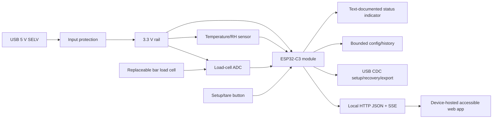
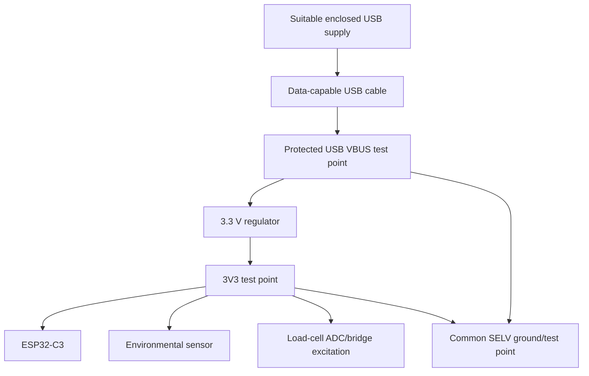
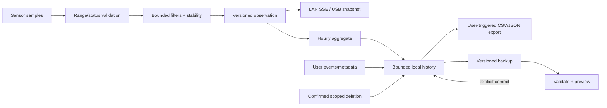
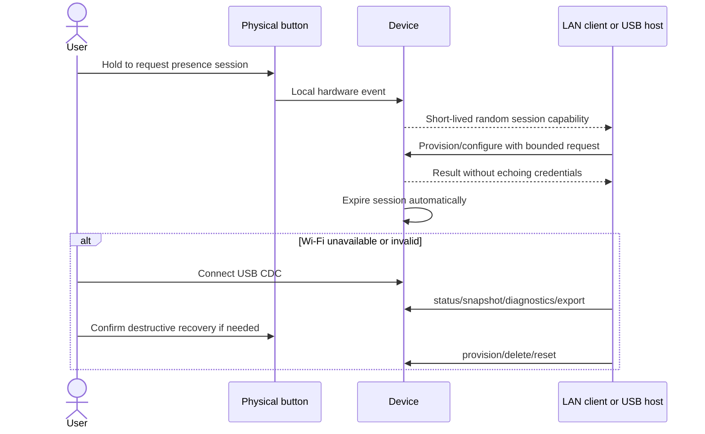
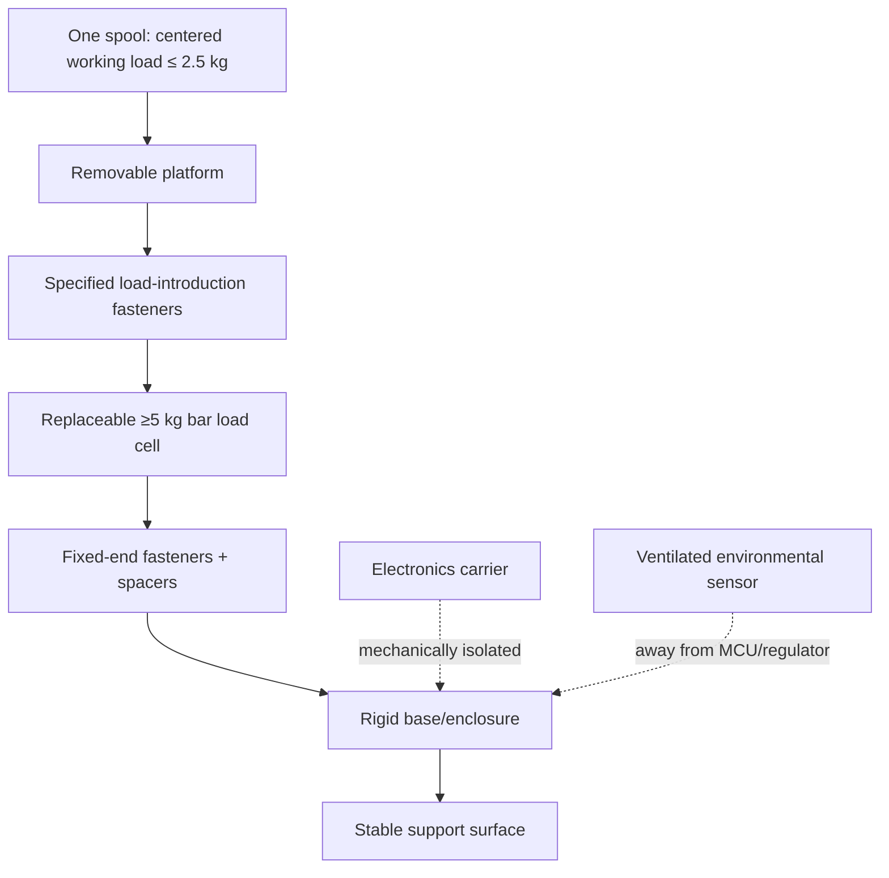

# Spool Sentry v0.1 architecture

This architecture implements the frozen boundary in [requirements.md](requirements.md). Diagrams are Mermaid/text source and remain editable in git.

## End-to-end blocks

Only observation data crosses the sensor boundary. There is no actuator output.

## Power domains

Issue #2 must replace generic blocks with datasheet-backed parts and document worst-case/inrush current with 20% path margin. The PCB shall keep load-cell analog routing/return away from radio and digital switching.

## Data and ownership

The device is authoritative. The browser may cache static assets and ephemeral preferences, not authoritative history or credentials. Restore never mutates before validation and explicit commit.

## Provisioning and recovery

LAN HTTP assumes a trusted network and is not exposed through a cloud relay, port mapping, or internet discovery. USB is the mandatory offline recovery path.

## Mechanical force path

The moving platform may not contact the PCB or enclosure over the working range. Off-center and overload behavior remain bench-verification items; the design shall not claim universal spool fit.

## Responsibility boundaries

| Boundary | Owns | Does not own |
|---|---|---|
| Hardware | protected SELV input, sensors, controller, test/debug access, carrier, force path | mains/battery/charging, actuation, safety interlocks |
| Firmware | sampling, quality/fault state, calibration, bounded storage, protocol, provisioning/recovery | cloud service, print prediction, certified measurement |
| Companion | accessible local workflows, history, events, export/restore/deletion | authoritative storage, phone permissions, cloud sync |
| Protocol | versioned bounded LAN/USB semantics and fixtures | hostile-internet security, remote access |

## Dependency gates

1. This requirements/architecture baseline gates exact part selection (#2), host-domain firmware (#4), and fixture-first companion work (#5).
2. Exact hardware drivers wait for the datasheet-backed pins and interfaces from #2.
3. PCB/mechanics (#3) wait for the reviewed schematic and exact parts.
4. Bench claims and release outputs wait for an assembled prototype (#6/#7).
